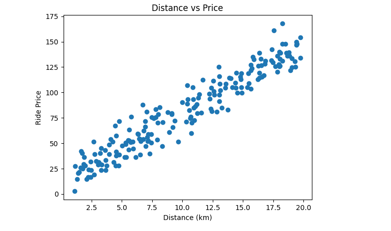
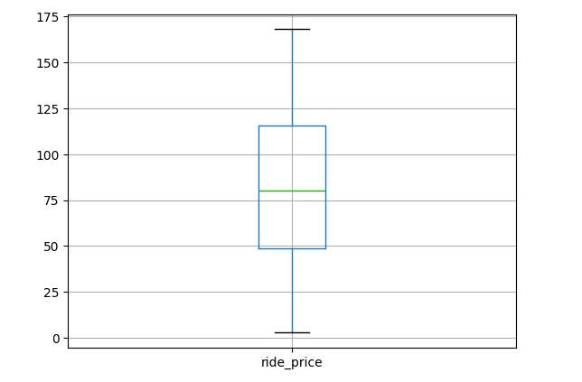
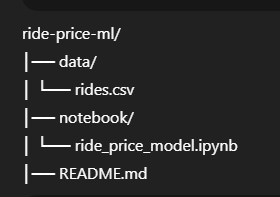

# Ride Price Estimation System

  

## Project Overview

This project builds an end-to-end Machine Learning system to estimate ride prices based on trip and contextual factors.

The system performs two tasks:

- Regression: Predict the continuous variable `ride_price`
- Classification: Predict whether a ride is `high_cost` or `low_cost`

The objective is to simulate a real-world ride-hailing pricing model and apply the complete Machine Learning workflow from problem framing to evaluation and reflection.

---

## Learning Problem Definition

### Problem Type

This is a Supervised Learning problem involving:

- A regression task to predict ride price.
- A classification task to predict high-cost versus low-cost rides.

### Goal

The goal is to learn how trip characteristics and contextual factors influence ride pricing. The model should identify patterns in the data that determine how different variables contribute to the final ride price.

---

## Why Use Machine Learning Instead of Fixed Rules?

Ride pricing depends on multiple interacting factors such as traffic level, demand level, weather condition, time of day, and trip distance.

A simple rule such as:

price = distance * 5

cannot capture complex interactions like surge pricing during high demand, increased costs during bad weather, or combined effects of traffic and peak hours.

Machine Learning allows the system to automatically learn pricing patterns from data rather than relying on manually defined rules. This makes the pricing model more flexible, scalable, and adaptive.

---

## What the Model is Expected to Learn

The model should learn:

- How distance impacts base ride cost.
- How traffic increases trip duration and overall price.
- How demand level creates surge pricing effects.
- How weather conditions influence pricing.
- How multiple features interact together to determine the final ride price.

---

## Dataset Description

The dataset was synthetically generated to simulate realistic ride-hailing scenarios.

Dataset characteristics:

- 200 rows
- 7 input features
- 1 continuous target variable (`ride_price`)
- Both numerical and categorical variables

---

## Features Used and Justification

| Feature        | Type        | Justification |
|---------------|------------|---------------|
| distance_km   | Numerical  | Primary factor determining base ride cost |
| duration_min  | Numerical  | Longer trips require more time and fuel |
| time_of_day   | Categorical | Peak hours increase pricing due to higher demand |
| traffic_level | Categorical | Heavy traffic increases travel time and operational cost |
| weather       | Categorical | Rain or poor weather increases demand and pricing |
| demand_level  | Categorical | High demand leads to surge pricing |
| day_type      | Categorical | Weekend pricing may differ from weekdays |
| ride_price    | Continuous (Target) | The variable the regression model predicts |

---

## Feature Considered but Not Included

Driver Rating

Although driver rating may influence ride allocation or user experience, it does not directly determine ride pricing in most pricing systems. Therefore, it was excluded to keep the dataset focused on pricing-related factors.

---

## Data Preparation

The following preprocessing steps were applied:

- Handling missing values
- Encoding categorical variables using one-hot encoding
- Scaling numerical features using standardization
- Detecting and treating outliers
- Splitting the data into training and testing sets

Poor data quality could negatively affect model performance by introducing bias, increasing prediction error, and reducing generalization ability.

---

## Models Implemented

### Linear Regression (Regression Task)

The Linear Regression model was trained to predict continuous ride prices.

Evaluation metrics used:

- Mean Absolute Error (MAE)
- R² Score

A predicted vs actual price plot was generated to visualize model performance.

---

### Logistic Regression (Classification Task)

A binary target variable (`high_cost`) was created based on the median ride price.

The Logistic Regression model was trained to classify rides as high-cost or low-cost.

Evaluation metrics used:

- Accuracy
- Confusion Matrix

The model outputs probabilities representing the likelihood that a ride belongs to the high-cost category. A threshold (typically 0.5) is used to convert probabilities into class labels.

---

## Model Evaluation and Comparison

Regression provides exact price estimates and is useful for detailed pricing predictions.

Classification simplifies the outcome into categories (high-cost vs low-cost), which may be useful for decision-making or business insights.

Data quality, feature scaling, and encoding significantly influenced model performance. Proper preprocessing improved both regression accuracy and classification reliability.

Distance and demand level were identified as the most influential features in determining ride price.

---

## Ethical and Practical Reflection

### Potential Unfair Pricing Behavior

High-demand areas may consistently experience higher prices, which could disproportionately affect lower-income communities.

### Real-World Risk

If deployed without monitoring, the model could reinforce biased pricing patterns learned from historical data.

### Dataset Limitation

The dataset is synthetic and does not include real-world factors such as fuel prices, geographic zones, driver availability, or operational costs. Therefore, it may not fully reflect real-world ride pricing complexity.

---

## How to Run the Project

1. Clone the repository:

https://github.com/ShaneseEm/ride-price-ml

2. Navigate to the project folder:

cd ride-price-ml

3. Open the notebook:

notebook\ride-price-model.ipynb

4. Run all cells sequentially to reproduce the results.

---

## Repository Structure

---

## Conclusion

This project demonstrates the complete Machine Learning workflow:

- Problem framing
- Dataset design
- Data preprocessing
- Model training
- Model evaluation
- Ethical reflection

It highlights how Machine Learning can model complex pricing systems more effectively than fixed-rule approaches.

